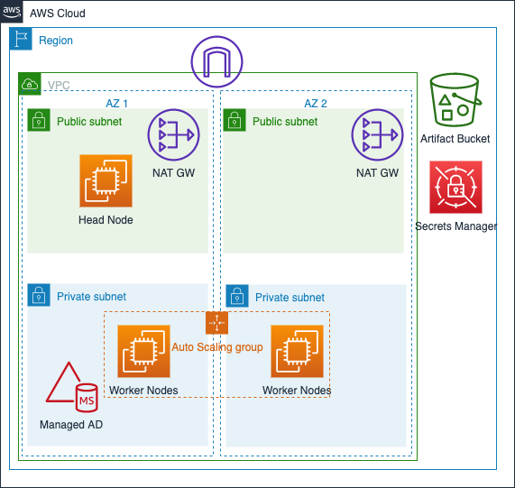

# HPC Pack 2019

This sample, non-production-ready AWS CloudFormation template will launch a Windows-based HPC cluster running Windows Server 2016 and supporting core infrastructure including Amazon VPC and Domain Controllers.
© 2021 Amazon Web Services, Inc. or its affiliates. All Rights Reserved.
This AWS Content is provided subject to the terms of the AWS Customer Agreement available at
http://aws.amazon.com/agreement or other written agreement between Customer and either
Amazon Web Services, Inc. or Amazon Web Services EMEA SARL or both.

## Why should I use this solution?

You should use this solution if you want to install HPC Pack to manage a cluster of Windows Servers for High Performance Computing.

## Architecture

## Deployment

### Deployment Artifacts

Create an S3 bucket to store deployment artifacts. Note the bucket name and region as these will be used when deploying CloudFormation templates. A bucket named `hpcpack-2019-[YOUR AWS ACCOUNT ID]` should ensure the bucket name is globally unique. You can leave all other S3 settings as default.

Next, create an S3 bucket to store the HPC output artifacts. Note the bucket name and region as these will be used when deploying CloudFormation templates. A bucket named `hpcpack-2019-outputs-[YOUR AWS ACCOUNT ID]` should ensure the bucket name is globally unique. You can leave all other S3 settings as default.

Next, navigate to the ../hpcpack-2019 directory.

Next, upload the `ScriptsForComputeNode2019.zip` and `ScriptsForHeadNode2019.zip` files to your S3 bucket.

Download HPC Pack from Microsoft's website (https://www.microsoft.com/en-us/download/confirmation.aspx?id=101360), rename the file to `HPCPack.zip`, and upload it to your S3 bucket.
- You can upload via either the AWS Console or CLI. If you have the AWS CLI set up, the uploading via CLI will upload the file faster. You can execute the following command to do so: `aws s3 cp HPCPack.zip s3://hpcpack-2019-[YOUR AWS ACCOUNT ID]`

### Deploy CloudFormation Templates

Navigate to the CloudFormation dashboard (https://console.aws.amazon.com/cloudformation/home) and choose "Create Stack" and choose the "With new resources" option. Then, click "Upload a template file", navigate to `hpcpack-2019/HPCLab/CloudFormation/`, choose `HPCLab2019.yml`, and click `Next`. Next, enter a Stack Name (preferably something that is easy to remember, like `HPC-Pack-Lab`). Then, choose parameters that are appropriate for your installation.

For `computeNodeInstanceCount`, we recommend specifying 2 compute nodes for demonstration purposes.

For `keyName`, use an EC2 Key pair you own. If you don't have a key pair, create a new EC2 Key Pair by navigating to (https://console.aws.amazon.com/ec2/v2/home?region=us-east-1#KeyPairs:)

 Click through the prompts, and deploy the solution. It should take about 30 minutes to fully deploy.

## Running Sample Job

1. Login to head node by opening your preferred RDP client (ie `Windows Remote Desktop or Royal TSX`). Locate the public IP address of the head node in the EC2 Console (You can also find this in the deployed CloudFormation template Outputs section under publicIP). Login should be `HPCLAB\admin`. Password is the same password entered at into the CloudFormation parameters at deployment

2. Within the RDP client, once you're logged into the head node, open HPC Cluster Manager. This will open HPC Pack 2019. You should see the head node and worker nodes under Resource Management. You are able to RDP into the compute nodes if you'd like.

3. Within HPC Cluster Manager, under Job Management, click Add job from XML

4. Add `C:/cfn/install/Parametric-Job-Prod.xml`

5. Leave all other settings as default. Click Submit. You may need to enter your password you used from the CloudFormation deployment.

6. Let the job run and when it's finished, navigate to the `S3 OUTPUT BUCKET` you specified in the CloudFormation deployment parameters. S3 Bucket should be named `hpcpack-2019-outputs-[YOUR AWS ACCOUNT ID]`. Your output files should be there. Feel free to download the `eplustbl.htm` to local to view the results in a web browser. You're finished with processing! You can also continue to analyze the data in S3 using Glue, Athena, and SageMaker for analytics/machine learning.

7. Moving forward, You can also Right Click the finished job -> View Job to view tasks performed on the compute nodes. You can also copy the job and edit the job based on a number of HPC job settings relating to core/node allocation etc for additional job creation. Great job!

## FAQ

## Disclaimer

This package depends on and may incorporate or retrieve a number of third-party
software packages (such as open source packages) at install-time or build-time
or run-time ("External Dependencies"). The External Dependencies are subject to
license terms that you must accept in order to use this package. If you do not
accept all of the applicable license terms, you should not use this package. We
recommend that you consult your company’s open source approval policy before
proceeding.

Provided below is a list of External Dependencies and the applicable license
identification as indicated by the documentation associated with the External
Dependencies as of Amazon's most recent review.

THIS INFORMATION IS PROVIDED FOR CONVENIENCE ONLY. AMAZON DOES NOT PROMISE THAT
THE LIST OR THE APPLICABLE TERMS AND CONDITIONS ARE COMPLETE, ACCURATE, OR
UP-TO-DATE, AND AMAZON WILL HAVE NO LIABILITY FOR ANY INACCURACIES. YOU SHOULD
CONSULT THE DOWNLOAD SITES FOR THE EXTERNAL DEPENDENCIES FOR THE MOST COMPLETE
AND UP-TO-DATE LICENSING INFORMATION.

YOUR USE OF THE EXTERNAL DEPENDENCIES IS AT YOUR SOLE RISK. IN NO EVENT WILL
AMAZON BE LIABLE FOR ANY DAMAGES, INCLUDING WITHOUT LIMITATION ANY DIRECT,
INDIRECT, CONSEQUENTIAL, SPECIAL, INCIDENTAL, OR PUNITIVE DAMAGES (INCLUDING
FOR ANY LOSS OF GOODWILL, BUSINESS INTERRUPTION, LOST PROFITS OR DATA, OR
COMPUTER FAILURE OR MALFUNCTION) ARISING FROM OR RELATING TO THE EXTERNAL
DEPENDENCIES, HOWEVER CAUSED AND REGARDLESS OF THE THEORY OF LIABILITY, EVEN
IF AMAZON HAS BEEN ADVISED OF THE POSSIBILITY OF SUCH DAMAGES. THESE LIMITATIONS
AND DISCLAIMERS APPLY EXCEPT TO THE EXTENT PROHIBITED BY APPLICABLE LAW.

EnergyPlus version 9.5.0 - https://energyplus.net/licensing

